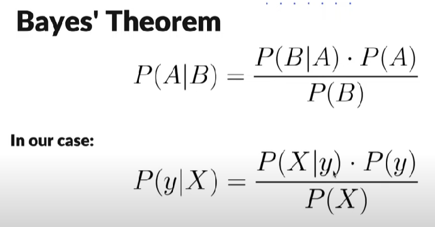

# Naive Bayes from Sklearn

### Its essence lies in the fact that we have some data, and we "naively" translate that they are not all collinear. We will use the formula below.

### There are different kinds of Naive Baye classifiers:

- GaussianNB: Gaussian. Second hand Gaussian population.
- MultinomialNB: Polynomial - Naive Bayes classifier for polynomial models.
- ComplementNB: Complementary - Naive Bayes complement classifier.
- BernoulliNB: Bernoulli - Naive Bayes classifier for multivariate Bernoulli models.
- CategoricalNB: For categorical features