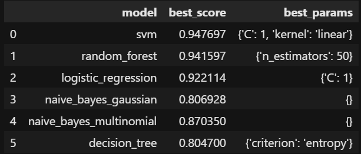

# Naive Bayes from Sklearn

### The main purpose is to use for the selection of the best model in machine learning, and for the selection of the best parameters of this model. Example:

### Main Changes:

- **estimator**: Set the Model we want to run

- **param_grid**: Set the parameters we want to run for this Model

- **cv**: How many parts to split the Dataset for the concept of Cross Validation