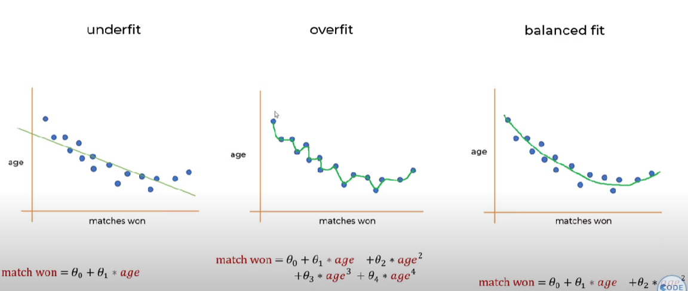
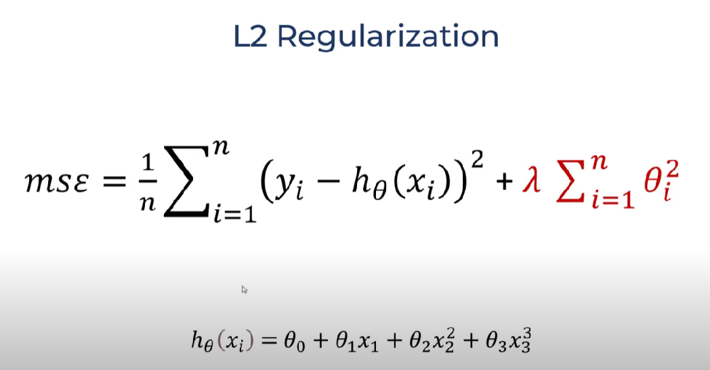
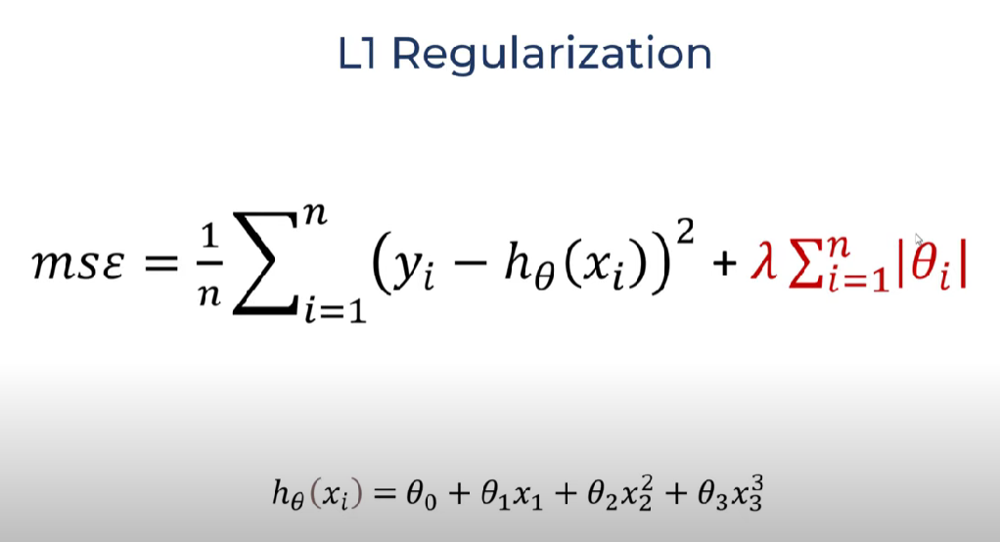

# Regularization from Sklearn

### The main concept of using Regularization is to combat Model overfitting.

### To fight, we penalize the model by the square of the weights (Ridge), or by the module of the weights (Lasso)

### Main Changes:

- ***alpha**:* coefficient before weights for regularization
- ***max_iter***: maximum number of iterations for the model
- ***solver** {'auto', 'svd', 'cholesky', 'lsqr', 'sparse_cg', 'sag', 'saga', 'lbfgs'}*: **Optimization Algorithms Ridge model only .**

'**auto**' automatically selects a solver based on the data type.

'**svd**' uses the singular value decomposition of X to calculate the ridge

'**cholesky**' uses the standard scipy.linalg.solve function to obtain a closed form solution.

'**sparse_cg**' uses a conjugate gradient solver as shown in [scipy.sparse.linalg.cg](http://scipy.sparse.linalg.cg/). As an iterative algorithm, this solver is more suitable than "cholesky" for large scale data

'**lsqr**' uses a special regularized least squares procedure. scipy.sparse.linalg.lsqr. It is the fastest and uses an iterative procedure.

'**sag**' uses stochastic mean gradient descent, while '**saga**' uses an improved, unbiased version of it called SAGA. Both methods also use an iterative procedure, and often faster than other solvers when both n_samples and n_features are large.