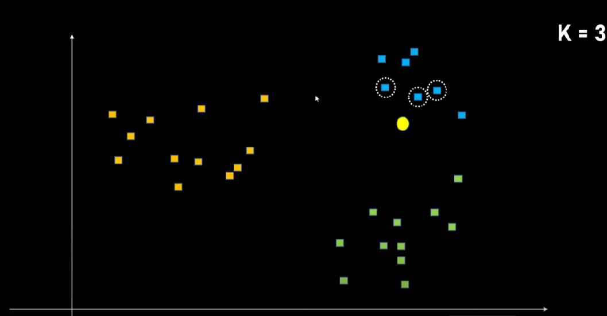
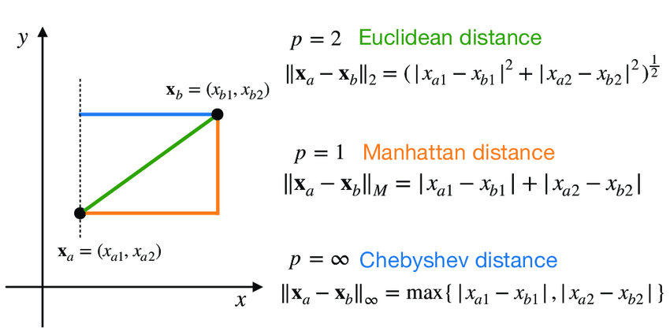

# KNN from Sklearn

### The main concept is that we have a split sample, and some new point is placed in this sample, and using the KNN algorithm, we can determine:

- Regression task - Find its features as a value
- Classification task - Find its nearest class

### Main Changes:

- ***n_neighbors**: The number of neighbors we are considering. This parameter is usually 5, can be selected using GridSearch*

- ***weights** {'uniform', 'distance'}*: Weight function used in prediction. Possible values:

'uniform': equal weights. All points in each region have the same weight.
'distance': Weighting of points is inversely proportional to their distance. in this case, closer neighbors of the request point will have more influence than neighbors that are farther away.

- ***metric** default='minkowski'*: Minkowski distance is a parametric metric on Euclidean space that can be thought of as a generalization of Euclidian distance (Euclidian) and city block distance. (Manhatten)

- ***algorithm** : {'auto', 'ball_tree', 'kd_tree', 'brute'}, default='auto' Algorithm used to calculate nearest neighbors:*

'**ball_tree**' used class Ball Tree
'**kd_tree**' used class Kd Tree
'**brute**' will use a brute-force search.
'**auto**' will try to determine the most appropriate algorithm