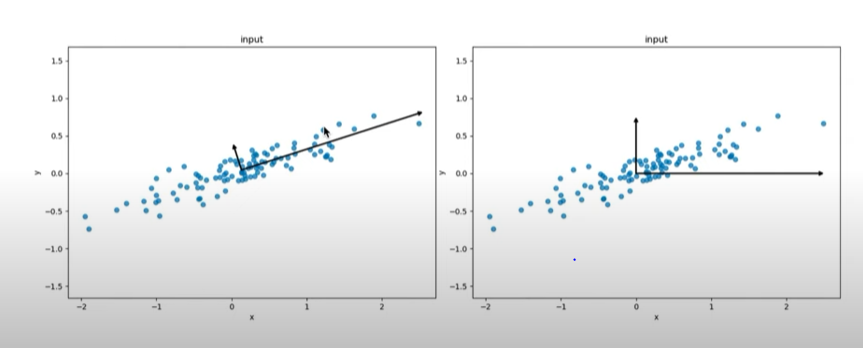
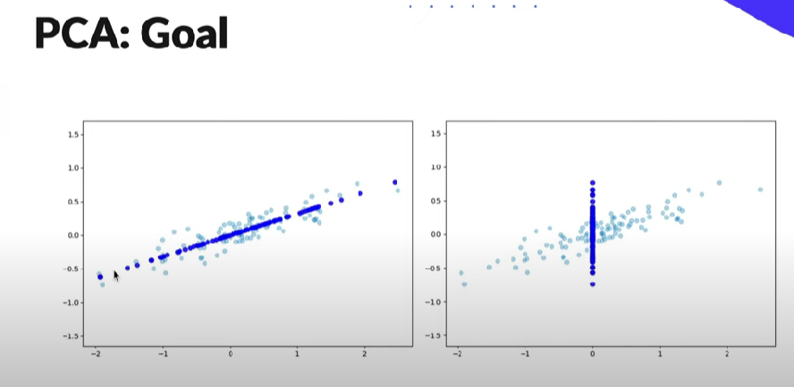

# PCA from Sklearn

### In general, the meaning is this, the decomposition of PCA gives a decomposition into eigenvectors and eigenvalues. Moreover, such that the largest eigenvalues in terms of information concentration go first and then decrease.

### **The main goal is that we are looking for such features that give us the greatest variance (dispersion). That is, so that the points that will be projected onto the axis are as much as possible discharged from each other. **

### Main Changes:

- ***n_components**:* Number of components to keep. You can enter a number from [0, 1]. Then we will use a certain cutoff threshold, or you can enter a certain number from 1 to the number of features - 1 to decide exactly how many features we want to keep

- ***svd_solver**:* {'auto', 'full', 'arpack', 'randomized'}, default='auto': Feature selection approach