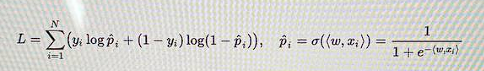

# Logistic Regression Model from Sklearn

### Use when we need to find a binary target feature(class) relative to non-target feature

### For binary logistic regression, we use BCEloss Loss with the Sigmoid activation function.

**Formula:**

### Change:

- *Number of signs per input*. This does not go to the model itself, but simply how much we transfer
- *multi_class*: {'auto', 'ovr', 'multinomial'}, default='auto'.

ovr to compare one against all

multinomial For "polynomial" losses, the polynomial losses are minimized.
over the entire probability distribution

- *penalty:* **Type of Penalty(Regularization) L1/L2**
- *solver:* **Optimization Algorithms ('newton-cg', 'lbfgs', 'liblinear', 'sag', 'saga'):**

For small datasets, "liblinear" is a good choice, while "sag"
and "saga" is faster for large ones;

For multi-class tasks only "newton-cg", "sag", "saga" and
'lbfgs' handles polynomial loss;

"liblinear" is limited to one-on-one schemes.

**Which types of penalty the Algorithms support:**

- 'newton-cg' - ['l2', 'none']
- 'lbfgs' - ['l2', 'none']
- 'liblinear' - ['l1', 'l2']
- 'sag' - ['l2', 'none']
- 'saga' - ['elasticnet', 'l1', 'l2', 'none']