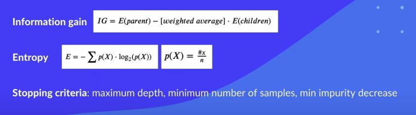
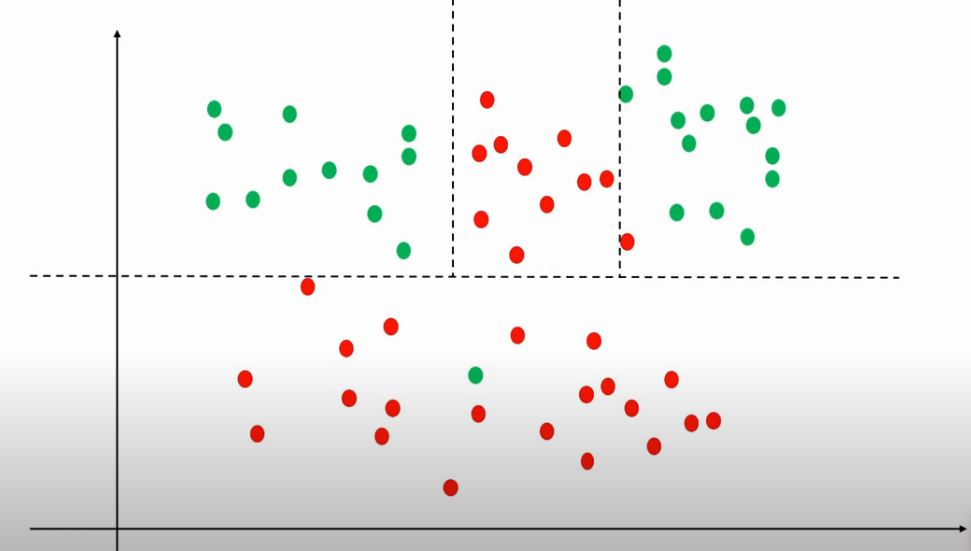

# Decision Tree Model from Sklearn

### In hyperspace, we want to find such lines in order to separate our signs in the best way. To do this, we use the Information Gain and Entropy.

### Learn : The main concept is that we take each feature in turn and look for informativeness. Which sign has better information content, that's why we go down.

- Information Gain: its Criterion(Parents) - Criterion(Child)
- Criterion: Its Number of features class 0 and number of features class 1
- Criterion can be Gini, Entropy, LogLoss

### Changes:

- max depths
- min number of features in Node
- number of features
- Criterion: Gini, Entropy, LogLoss