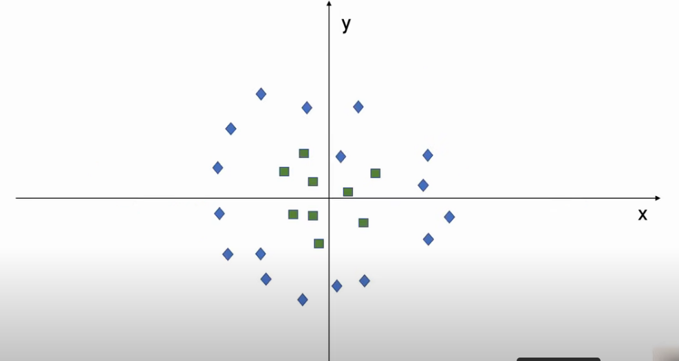
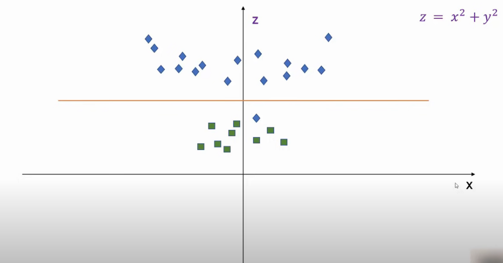
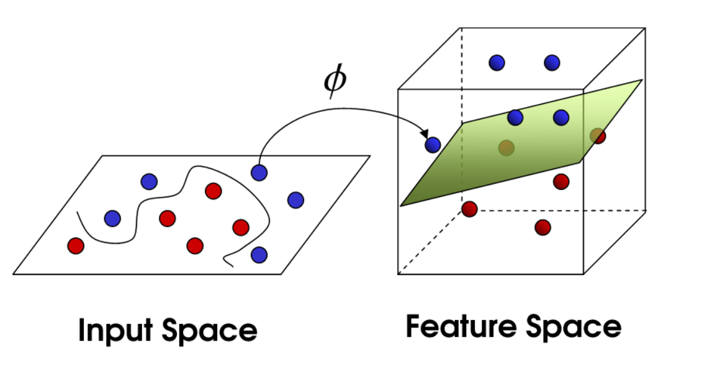

# SVM Model from Sklearn

### The most important thing about the SVM model is that we can use the kernel trick in order to expand the space and make our classification better. The SVM model tries to find the maximum distance between class points. the third dimension is Z = x^2+y^2

- Transform 2D to 3D View

- kernel trick

### Changes:

- Regularization C
- Gamma
- Kernel (Linear, Polynomial, rbf, sigmoid)