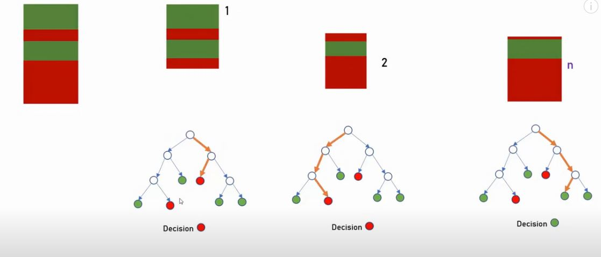

# Random Forest Model from Sklearn

### We simply divide the training sample into many separate models, and at the end we consider which model responses, and choose the response of which is greater. Models can be retrained and be as random and different from each other as possible. This is the main concept

