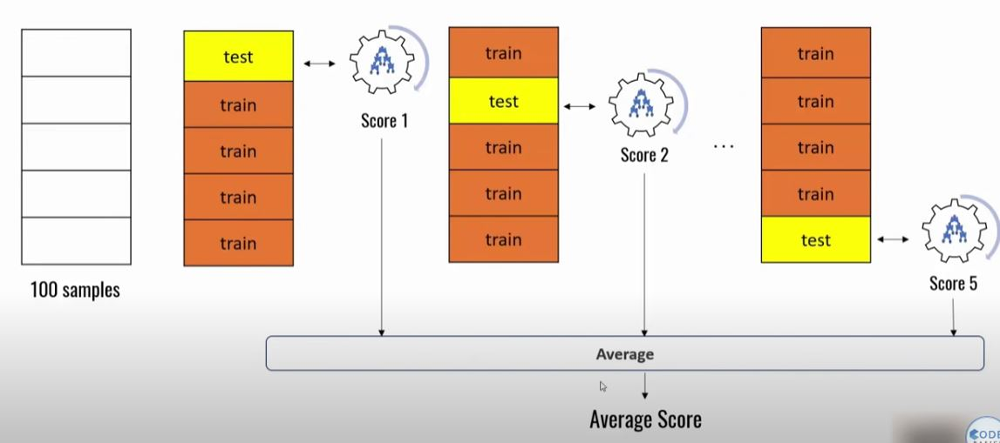

# Cross Validation Model from Sklearn

### The main concept is that we want to divide the training sample many times. That is, we divide the Dataset into 5 equal parts, and then first we take the first part as a test, the rest of the train, train and get the answer. Then the second part, and so on. As a result, we get the number of answers such as how many parts we divided our Dataset into. This helps to remove the randomness that comes from randomly dividing the Dataset into parts, for example 0.7 / 0.3, etc.

### Changes:

- cv: Number of parts