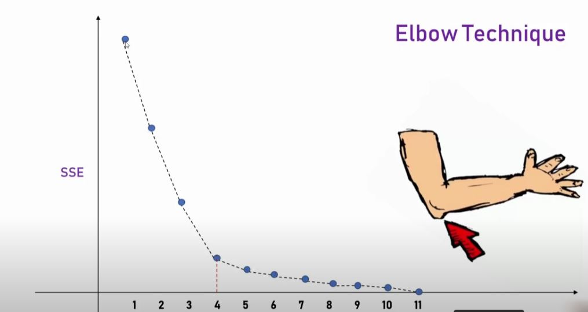

# K Means from Sklearn

### A technique that is used for unsupervised learning. When we have a lot of data and their features, and we want to split them into some groups (clusters). To do this, you need to do 2 things:

- Normalize the features so that they are in the same data space, for example from [0,1]

- Pick up the number of clusters. This is done using the Elbow technique

### Changes:

- n_clusters: number of clusters
- init: initialization (k-means++, random)
- n_init: number of init tries
- algorithm : algorithm : {"lloyd", "elkan”}